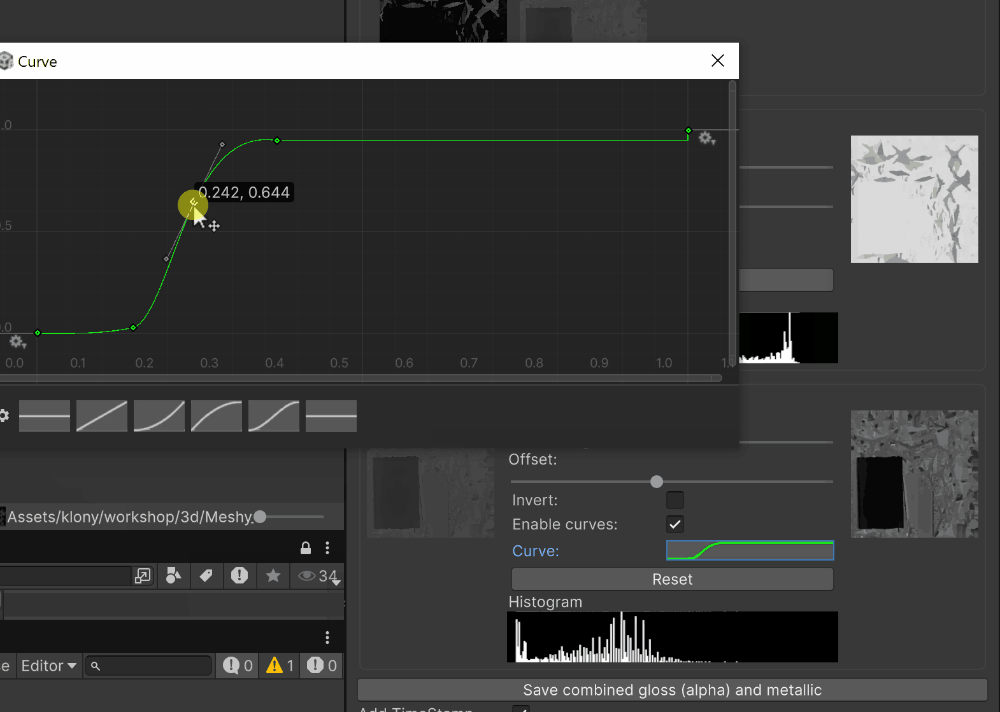
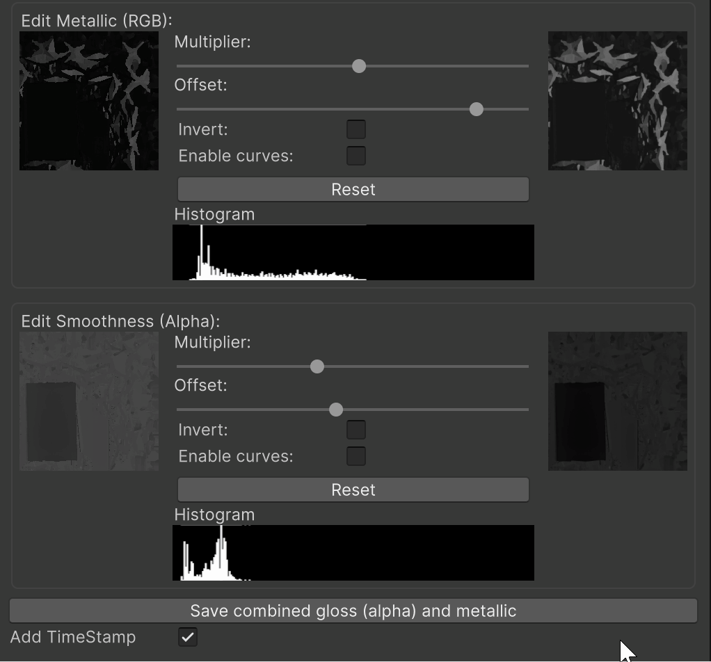
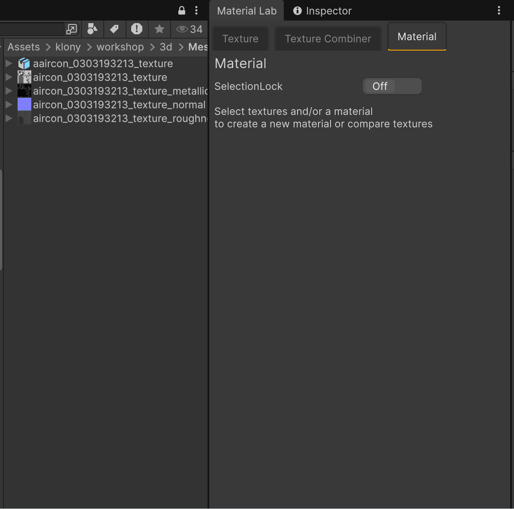

# MaterialLab

*Tired of opening Photoshop just to tweak levels on a texture? Or missing out on PBR because downloaded metallic/roughness maps need to land in an alpha channel for Unity — another round-trip in an external editor? Or sitting on piles of textures with no patience to wire them into materials? MaterialLab is an editor-only toolkit that lets you edit texture assets in place, combine PBR maps, and one-click materials from selected textures — without leaving Unity.*

## Material creation

One-button material creation: select your textures, see roles inferred from filenames, hit **Create new material**. The tool creates a `.mat` next to your primary texture, assigns Main, Metallic, Normal, Height, Occlusion, Emission as the shader supports, and selects the new asset. If you have hundreds of textures and want to try combinations, this can save hours. I’ve been through those hours; this tool is what I brought back from the trip.

---
## Editing textures  (curve + levels + invert + histogram)

With MaterialLab you can edit texture assets in place without leaving Unity. Levels, curves, and histogram feedback live in the Texture Edit tab; no external editor required.

Layout: source preview | controls (sliders, invert, curve) + histogram | result preview.

 Histogram is built from a low-res proxy so feedback is fast; it updates as you tweak. After “Save in place” or “Save with backup,” the panel keeps using an in-memory copy of the pre-save pixels so your meticulously dialed in curve/slider sweet-spot will still be relevant for tweaks - until you change the selection. 

 Surprisingly quite a wide range of transtormations can be acieved with only levels/curves/invert/flip. Back when I was spending time as an After Effects operator, levels and curves combo was often the first (and sometimes the last) effect added to most layers. I used to be obsessed about curves, tested every plugin I could to be better than AE's built in curves. I can highly recommend [Fresh Curves](https://frischluft.com/curves/) if you wanted my recommendation. 

 Curve editor in Unity has not been designed specifically for that, but does the job well.
 
  If you find yourself dialing the perfect curve (if you want to use Curves, you can reset and ignore gain and offset controls - all possible outcomes, including invert and a lot more can be set up using Curves alone).
  
  So anyways, when you dive in - remember to lock the selection using the toggle at the top of the window to avoid loosing your curve settings. The settings live in memory only, and will reset if you click on another texture. 
  
  If you want to do anything more serious than levels, curves, invert or flip - you are probably still going to use Gimp or a more sophisticated tool. 

## Texture Combiner ##  

- **Texture Combiner** — Metallic + roughness/smoothness → one Unity-style combined map (metallic RGB, smoothness alpha). Select 2–3 textures; roles are inferred; optional timestamp on output, save as new.

## Material tab (detail)

**From selected textures:** Builds TextureAssetMatcher from selection, shows a grid of role labels + texture previews, name field, **Create new material**. **From selected material:** Same grid fed from the material’s shader properties — inspect which textures the material uses. If both textures and a material are selected, both sections appear. Clicking a slot in the grid pings that texture in the Project window.

---

 **Role assignment from filenames** — TextureAssetMatcher infers PBR roles (Main, Albedo, Metallic, Roughness, Smoothness, Normal, Height, Occlusion, Emission) from texture names. Select a set of exported textures and the UI shows which role each got; heuristics avoid false hits. Same logic drives the Combiner and the Material tab. This way if you want to quickly build a lot of materials from multiple textures, you simply select desired texture set in the project window, and as long as parts of the filename suggest a role/purpose of this texture, you can press Create and have a new material created with a single click

## Texture Edit (flip)

Single-texture operations: choose a texture, use **Locate** to ping it in the Project window, pick an operation (flip, rotate, invert, etc.). Result is saved as a **new asset** next to the original. **Edit** reveals TextureAdjustElement: multiplier/offset sliders, invert, curve editor, histogram, Reset. Timestamp/naming is shared with the Combiner (“Save as new”, “Add timestamp”).

---

## Other features at a glance

- **Tabbed window** — Texture Edit, Texture Combiner, Material. Each tab tracks selection independently.
- **Selection lock** — Each tab has a selection-lock toggle (in the base tab). When locked, all `SelectionChanged` callbacks are ignored, so you can use Unity’s selection for something else (e.g. inspecting another asset) without the tab switching context.
- **Alpha preview** — TexturePreviewElement can show color, alpha, or alpha-normalized with min/max; checkerboard icon in the corner cycles modes. Handy for placing smoothness in alpha.
- **Make readable** — If a texture isn’t readable, a **Fix** button appears; enabling Read/Write and reimport is explicit, not automatic.

---

## What each save button does (and why it matters)

**Before you touch anything:** Destructive edits overwrite files. Prefer “Save as new” or “Save with backup” until you’re sure. If you don’t use version control, one bad slider session can overwrite originals with no way back.

- **Save in place** — Overwrites the current asset. Fast, immediate results (all materials using this texture are affected immediately) destructive. It is recommended to create a physical copy of the texture asset in the project window using (ctrl+D/cmd+D). Only use when you know the asset is versioned or disposable.
- **Save as new** — Writes a new file with a timestamp suffix; the new asset is tracked so **Undo File Creation** can remove it and restore selection. Safe default for “I want to keep the original.”. This creates a fresh asset that is not initially linked to anything.
- **Save with backup** — Best of both worlds - copies the original to `*_backup_<timestamp>`, then overwrites the original. Lets you keep tweaking and re-saving; the editor keeps an in-memory snapshot of the pre-save texture so your sliders/curves still apply to what you had until you change selection.

Save buttons only appear after you change something (multiplier, offset, invert, curve). **Reset** restores controls to defaults without saving.

---

## Safety

Operations that overwrite originals are explicit (Save in place, Save with backup). Default bias is **new assets** — “Save as new” and “Save with backup” are the safe options. If you move sliders and destructively save without version control, you can overwrite originals with no undo. If you’re still not using Git in 2025, may the AI have mercy on you.

